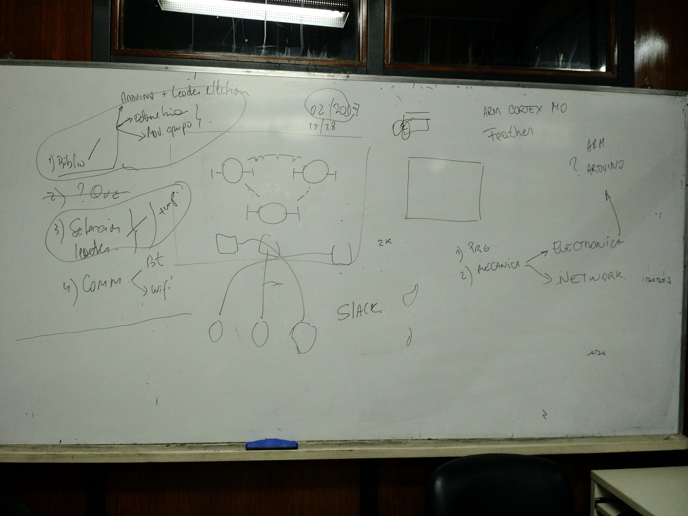
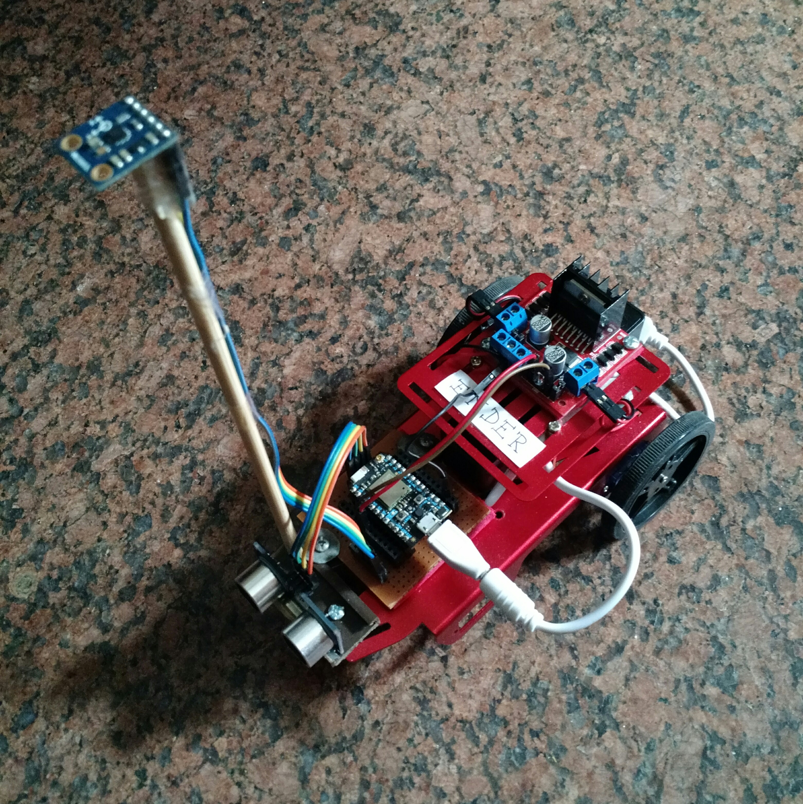
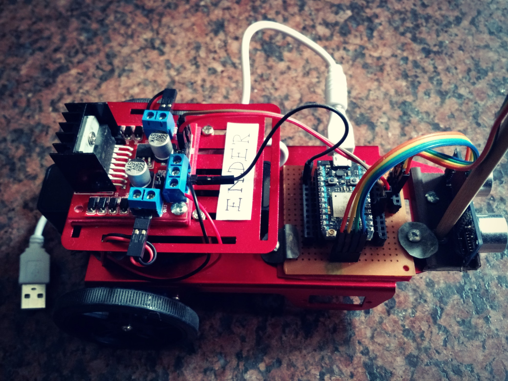
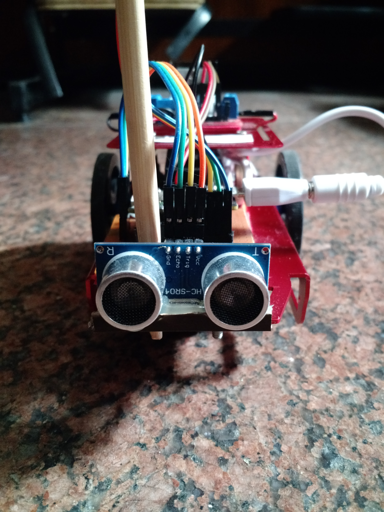

# The Robots Of Dawn
Trabajo realizado en el ambito del Grupo de Investigaciones en Ciencias Informáticas (REINVENT-fiuba).  

***Autores***:
* Ing. Adrián Martín, Durán.
* Ing. Daniel Andrés, Obon.
* Natalia Giselle, Bartolomé. 

## Objetivo del Proyecto

El objetivo del presente trabajo es presentar una solución de coordinación autónoma entre dispositivos IoT. Para lo cual se necesita implementar un algoritmo de elección de líder, el cual debe gobernar el comportamiento de la red de dispositivos permitiendo un análisis de la respuesta del sistema frente a la caída o falla del dispositivo elegido como coordinador.

Así surgió la idea:

{: width="640px"}  

La Implementación:  

{: width="512px"}
{: width="512px"}
{: width="512px"}

El informe del trabajo puede descargarse de [Informe](./informe.pdf)  
La presentación: [Presentación](/proyectos/onro/informe.pdf)  

Este trajo tine futuras lineas de investigación abiertas en REINVENT-fiuba (Grupo de Inertigación en Ciencias Informáticas), contactanos!!!!. 
